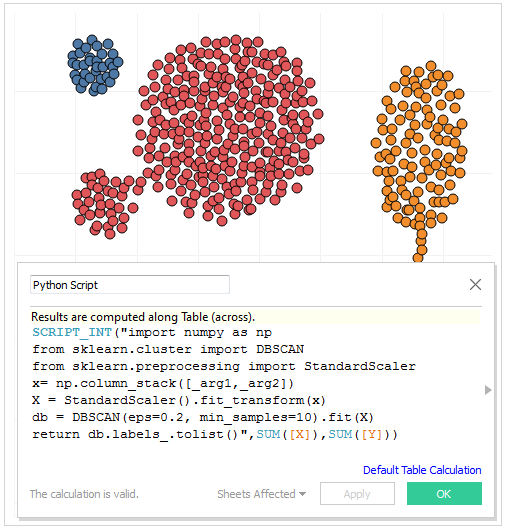

# Tableau Python Server - Beta

Tableau Python Server (TabPy) is part of Tableau's expanding range of extensibility options. These include [R execution](http://onlinehelp.tableau.com/current/pro/desktop/en-us/help.html#r_connection_manage.html) via the calculation editor interface, along with the web data connector SDK, the JavaScript API, the REST API, the Tableau Data Extract API, and Tableau Document API. For details, see the [Tableau Developer Portal](https://community.tableau.com/community/developers).

TabPy framework allows Tableau to remotely execute Python code. It has two components:

1. A [server](server.md) process built on Tornado, which allows for the remote execution of Python code through a set of REST APIs. Code can either be immediately executed or persisted in the server process and exposed as a REST endpoint, to be called later.
2. A [client library](client.md) that enables the deployment of such endpoints, based on Python functions.

Tableau can connect to the TabPy server to execute Python code on the fly and display results in Tableau visualizations. Users can control data and parameters being sent to TabPy by interacting with their Tableau worksheets, dashboard or stories.

You can find detailed **installation instructions** for TabPy server [HERE](server.md).

To run Python code in your Tableau calculated fields, enter the address and port number for a TabPy server instance in Tableau.

On Tableau Server, use the [tabadmin](https://onlinehelp.tableau.com/current/server/en-us/tabadmin.htm) command line utility to configure a TabPy connection.

It is not necessary to install TabPy on the Tableau Server or Desktop computer-all that is required is a pointer to a TabPy server instance.

Once the configuration is done, you can use Python in calculated fields in Tableau. You can learn more about authoring Python calculations in Tableau [HERE](TableauConfiguration.md).

## Security Considerations
The following security issues should be kept in mind as you use TabPy with Tableau:
  - The data channel between Tableau and TabPy is currently not encrypted.
  - TabPy currently does not use authentication.
  - Python scripts can contain code which can harm security on the server where the TabPy is running. For example:
    - Access file system (read/write)
    - Install new Python packages which can contain binary code
    - Execute operating system commands
    - Open network connections to other servers and download files
