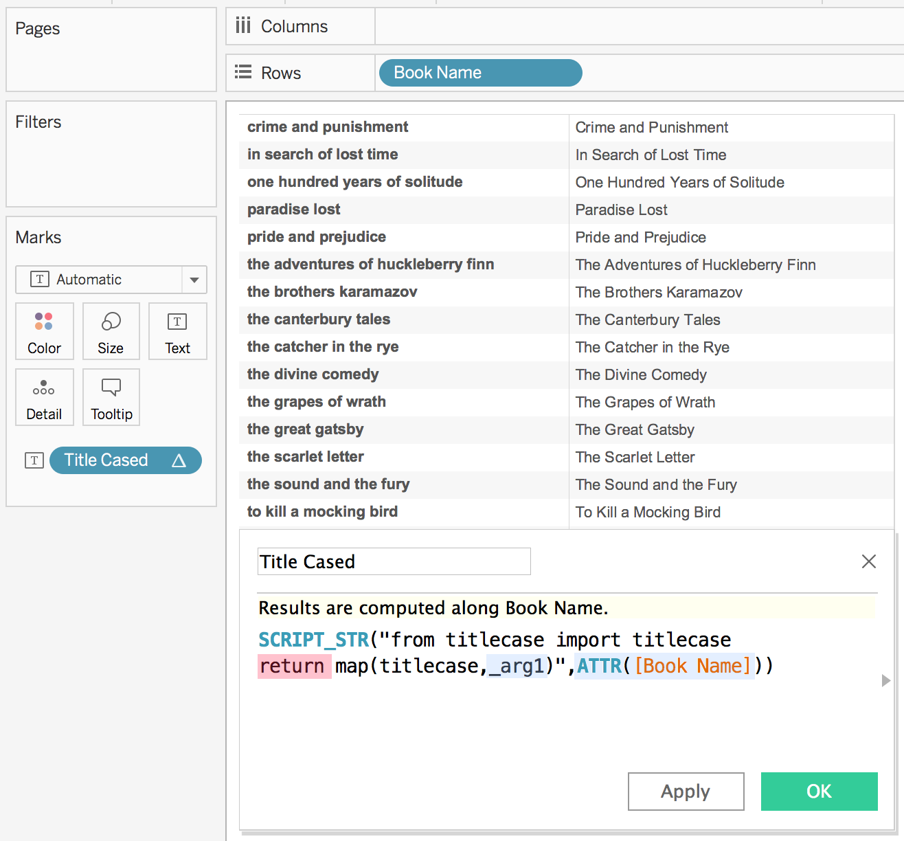

# Using Python in Tableau Calculations 
## Configuration
Once you have a [TabPy instance](server.md) set up you can easily configure Tableau to use this service for evaluating Python code.

In Tableau Desktop version 10.1 or later:
  1. Go to Help->Settings and Performance->Manage External Service Connection...
  2. Enter the Server (localhost if running TabPy on the same computer) and the Port (default is 9004).

<p align="center"></p>

For Tableau workbooks with embedded Python code to work on Tableau Server 10.1 or later, you need to go through a similar setup but using the [tabadmin](https://onlinehelp.tableau.com/current/server/en-us/tabadmin.htm) command line utility. 
The two server settings that need to be configured are `vizqlserver.extsvc.host` and `vizqlserver.extsvc.port`.

Note that it is not necessary to install TabPy on the Tableau Server or Desktop computer-all that is required is a pointer to a TabPy server instance.

Once you're done with configuration, you can use Python in calculated fields in Tableau.

## Anatomy of a Python Calculation
Tableau can pass code to TabPy through four different functions: SCRIPT_INT, SCRIPT_REAL, SCRIPT_STR and SCRIPT_BOOL to accommodate the different return types.
In the example below you can see a simple function that passes a column of book names (highlighted in blue) to Python for proper casing. Since Python returns an array of string, SCRIPT_STR function is used.
<p align="center"></p>
For a SCRIPT call to Python to be successful, it needs to return a result explicitly specified with the `return` keyword (highlighted in red).

In this simple example, there is only one input but you can pass as many arguments to SCRIPT functions as you like. Tableau takes the arguments in the order provided and replaces the _argN placeholders accordingly. In this case ATTR([Book Name]) maps to _arg1 and both are highlighted to indicate the association.

Tableau expects the SCRIPT to return a single column that has either a single row or the same number of rows as it passed to TabPy. The example above sends 18 rows of data to TabPy and receives 18 rows back.

In the example below Tableau passes multiple columns to TabPy and gets a single value (correlation coefficient) back. SUM(Sales) and SUM(Profit) are used as argument 1 and 2 respectively and highlighted in matching colors.
In this case the function `corrcoef` returns a matrix from which the correlation coefficient is extracted such that a single column is returned.

<p align="center"></p>

Tableau aggregates the data before sending to TabPy using the level of detail of the view. In this particular example each point in the scatter plot is a Customer and TabPy is receiving SUM(Sales) and SUM(Profit) for each Customer.

If you would like to run your Python code on disaggregate data, you can achieve this simply by unchecking the Aggregate Measures option under the Analysis menu.

The example above showcases another capability that can come in handy if you like to run the same Python script multiple times in different contexts. In this particular example, unchecking the Category and Segment boxes in the Table Calculation dialog results in Tableau making multiple calls to TabPy, once per each pane in the visualization.
Running regression analysis independently for each Segment-Category combination.

In all of these examples the data structure being returned by the function can be consumed by Tableau. This may not always be the case. If your Python code returns a one dimensional array but TabPy is failing to serialize it to JSON, you may want to convert it to a list as shown in the example below.

<p align="center"></p>

You can find two detailed working examples with downloadable sample Tableau workbooks on [our blog](https://www.tableau.com/about/blog/2017/1/building-advanced-analytics-applications-tabpy-64916).

## Using Deployed Functions
[TabPy client documentation](client.md) covers in detail how functions could be deployed as endpoints. You can invoke such endpoints using `tabpy.query` option by specifying the endpoint name and arguments and retrieving the `response` object. 

A SCRIPT calculated field in Tableau using the [add endpoint](client.md#deploying-a-function) defined in [TabPy client documentation](client.md) could look like the following: 

```
SCRIPT_REAL("
return tabpy.query('add',_arg1,_arg2)['response']",
-SUM([Discount]),SUM([Price]))
```
You can find a detailed working example with a downloadable sample Tableau workbook showing how to publish models and use the published models in calculated fields on [our blog](https://www.tableau.com/about/blog/2017/1/building-advanced-analytics-applications-tabpy-64916).
